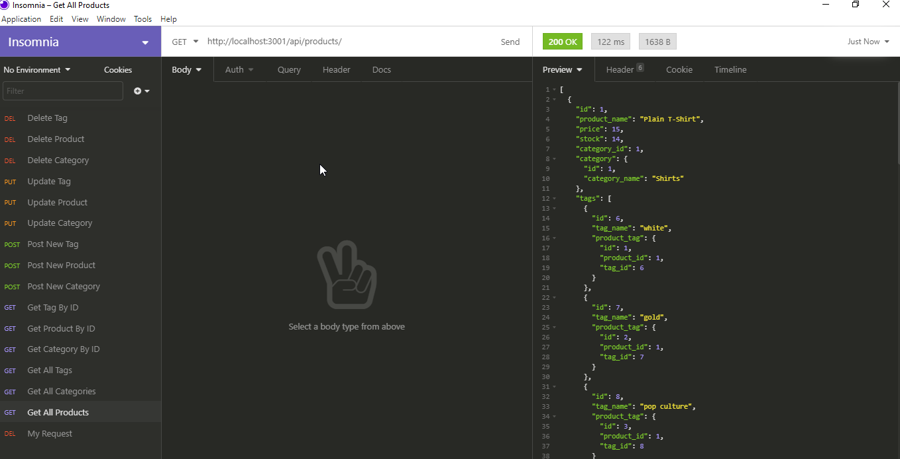

# ORM-E-Commerce-Back-End
# University of Toronto Coding BootCamp Challenge Week 13 - ORM

## You Tube Video
---
Video Link: (https://youtu.be/VFHfUnwejy0)

## Description
---
Back end for an e-commerce website. Using express to configure api routes and Sequelize to communicate with a MYSQL database.

## Screenshot
--- 

## Installation
---  
* Log into MYSQL terminal. 
* Run 'source db/schema.sql
* quit MYSQL
* NPM install
* node seeds/index.js
* npm start

## Testing
---
All routes tested with Insomnia.
